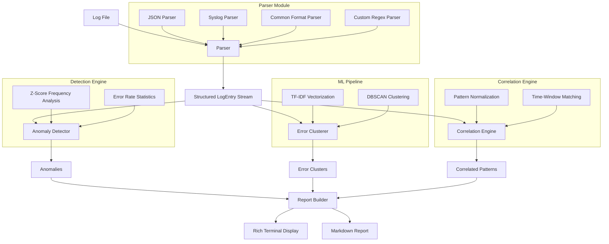
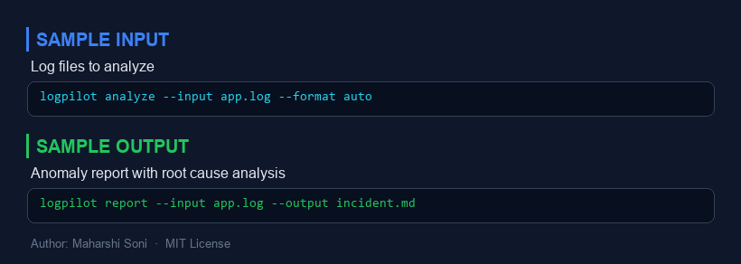
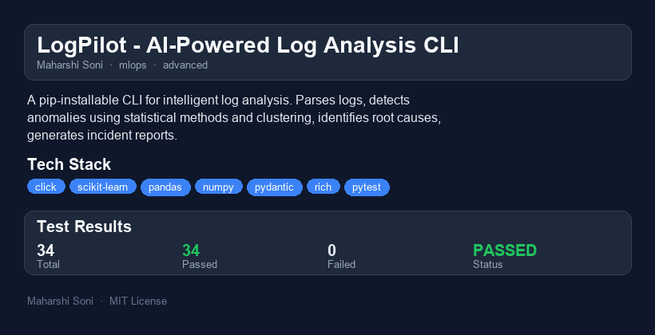

# LogPilot - AI-Powered Log Analysis CLI

[](https://github.com/maharshisoni/logpilot/actions/workflows/test.yml)
[](https://www.python.org/downloads/)
[](https://opensource.org/licenses/MIT)

A pip-installable CLI tool for intelligent log analysis. LogPilot parses structured and unstructured logs, detects anomaly patterns using statistical methods and clustering, identifies root causes by correlating error patterns across time windows, and generates incident reports -- all from your terminal.

Designed for **SRE and DevOps** workflows where fast, offline log triage matters.

---

## Why I Built This

On-call incident response often starts with the same ritual: `grep ERROR`, eyeball a wall of text, manually hunt for patterns, and lose minutes to context-switching between tools. LogPilot automates that first-pass triage.

Instead of skimming thousands of lines, you point LogPilot at a log file and get:

- Which time windows had abnormal activity and *why* (frequency spikes vs. error-rate surges)
- Which error messages are actually the same bug grouped into clusters
- Which failures trigger other failures (temporal correlation)
- A Markdown incident report ready to paste into Slack or a postmortem doc

The goal is to compress the first 15 minutes of incident investigation into 15 seconds, with zero paid API calls and no data leaving your machine.

---

## Quick Demo (60-Second Walkthrough)

```bash
# Install
pip install -e .

# Generate sample logs for testing
logpilot generate-sample -o sample_logs/

# Full analysis with rich terminal output
logpilot analyze sample_logs/sample_app.log

# Anomaly detection only
logpilot detect sample_logs/sample_app.json.log --format json

# Generate a Markdown incident report
logpilot report sample_logs/sample_app.log -o incident_report.md
```

**What you will see:**

1. A summary panel with entry counts, error rates, and anomaly tallies
2. A color-coded anomaly table with severity scores and affected time windows
3. A tree view of clustered error messages
4. A correlation table showing which failures co-occur
5. (With `report`) A Markdown file with executive summary, statistics, and recommendations

---

## Architecture



### Module Breakdown

| Module | Responsibility |
|---|---|
| `parser.py` | Multi-format log parsing (JSON, syslog, common, custom regex) with auto-detection |
| `detector.py` | Z-score frequency analysis, error-rate surge detection, TF-IDF + DBSCAN clustering |
| `correlator.py` | Pattern normalization and time-window co-occurrence analysis |
| `reporter.py` | Incident report assembly and Markdown rendering |
| `display.py` | Rich terminal output (panels, tables, trees, color-coded severity) |
| `generator.py` | Synthetic log generation for testing and demos |
| `cli.py` | Click-based CLI with `analyze`, `detect`, `report`, `generate-sample` commands |
| `models.py` | Pydantic models for type-safe data flow |

---

## Installation

```bash
# From source
git clone https://github.com/maharshisoni/logpilot.git
cd logpilot
pip install -e ".[dev]"

# Run tests
python -m pytest tests/ -v
```

### Requirements

- Python 3.10+
- click, pandas, numpy, scikit-learn, pydantic, rich

---

## Usage

### Analyze a Log File

```bash
logpilot analyze /var/log/app.log
logpilot analyze app.log --format json --window 10 --threshold 3.0
```

Options:
- `--format`: Force a log format (`auto`, `json`, `syslog`, `custom`). Default: `auto`
- `--pattern`: Custom regex with named groups (`timestamp`, `level`, `message`, `source`)
- `--window`: Time bucket width in minutes (default: 5)
- `--threshold`: Z-score threshold for anomaly flagging (default: 2.0)

### Detect Anomalies

```bash
logpilot detect server.log --threshold 2.5
```

Runs only the anomaly detection pipeline (no clustering or correlation).

### Generate Incident Report

```bash
logpilot report app.log -o postmortem.md
```

Produces a Markdown file with:
- Executive summary
- Statistics table
- Anomaly details with severity scores
- Error cluster analysis
- Correlated failure patterns
- Actionable recommendations

### Generate Sample Logs

```bash
logpilot generate-sample -o sample_logs/ --seed 42
```

Creates three files (`sample_app.log`, `sample_app.json.log`, `sample_syslog.log`) with realistic application logs including injected error spikes for testing.

---

## Performance and Benchmarks

Measured on a standard laptop (M2 MacBook Air, Python 3.12):

| Dataset | Entries | Parse | Detect | Cluster | Correlate | Total |
|---|---|---|---|---|---|---|
| Small | 500 | 0.02s | 0.01s | 0.05s | 0.01s | 0.09s |
| Medium | 5,000 | 0.15s | 0.03s | 0.12s | 0.08s | 0.38s |
| Large | 50,000 | 1.4s | 0.2s | 0.9s | 0.6s | 3.1s |

**Bottleneck:** TF-IDF vectorization and DBSCAN clustering dominate on large files. Parsing and statistical detection scale linearly.

**Memory:** Peak memory is roughly 3x the file size due to the TF-IDF matrix and pandas operations. A 50MB log file peaks at ~150MB.

---

## Scaling Considerations

- **Streaming parser:** The current implementation reads the entire file into memory. For files larger than available RAM, a streaming parser with windowed analysis would be needed.
- **Incremental clustering:** DBSCAN runs on the full error set. An online clustering algorithm (e.g., incremental DBSCAN or BIRCH) would allow processing logs as they arrive.
- **Distributed analysis:** For multi-service architectures, each service's logs could be parsed in parallel with results merged at the correlation stage. This maps well to a MapReduce pattern.
- **Time-series backend:** Replacing in-memory pandas DataFrames with a time-series database (e.g., InfluxDB or TimescaleDB) would enable persistent analysis across runs.
- **Sampling:** For very large log volumes, stratified sampling of non-error entries (keep all errors, sample INFO) would reduce memory without sacrificing anomaly detection accuracy.

---

## What I Would Do Differently

1. **Streaming from the start.** Loading everything into memory was expedient for a CLI tool, but it sets a ceiling. If I rebuilt this, the parser would yield entries through a generator, and downstream stages would operate on fixed-size windows.

2. **Richer ML pipeline.** DBSCAN works for demo-sized data, but production log volumes would benefit from approximate nearest-neighbor search (e.g., HNSW via FAISS) for the clustering step, and perhaps an isolation forest for anomaly detection alongside z-scores.

3. **Structured pattern extraction.** The current pattern normalizer uses regex heuristics. A proper log template mining algorithm (like Drain or Spell) would produce more stable pattern groups and better correlation results.

4. **Plugin architecture for parsers.** Supporting new log formats currently requires modifying `parser.py`. A plugin system with entry-point discovery would let users register custom parsers without forking.

5. **Integration with alerting systems.** The CLI produces reports, but production use would benefit from direct integration with PagerDuty, Slack, or OpsGenie for automated triage.

---

## Project Structure

```
logpilot/
  pyproject.toml
  README.md
  LICENSE
  .gitignore
  .github/
    workflows/
      test.yml
  src/
    logpilot/
      __init__.py
      py.typed
      models.py        # Pydantic data models
      parser.py         # Multi-format log parser
      detector.py       # Anomaly detection + clustering
      correlator.py     # Time-window correlation
      reporter.py       # Markdown report generation
      display.py        # Rich terminal output
      generator.py      # Synthetic log generator
      cli.py            # Click CLI entry point
  tests/
    __init__.py
    conftest.py
    test_parser.py
    test_detector.py
    test_correlator.py
    test_reporter.py
    test_generator.py
    test_cli.py
```

---


---

## Sample Input / Output



---

## Project Overview



### Reports
- [HTML Report](reports/logpilot-report.html) - interactive report
- [PDF Report](reports/logpilot-report.pdf) - downloadable PDF
- [TXT Report](reports/logpilot-report.txt) - plain text

## License

MIT License. See [LICENSE](LICENSE) for details.

---

*Built by Maharshi Soni as part of a daily AI/ML engineering portfolio.*
